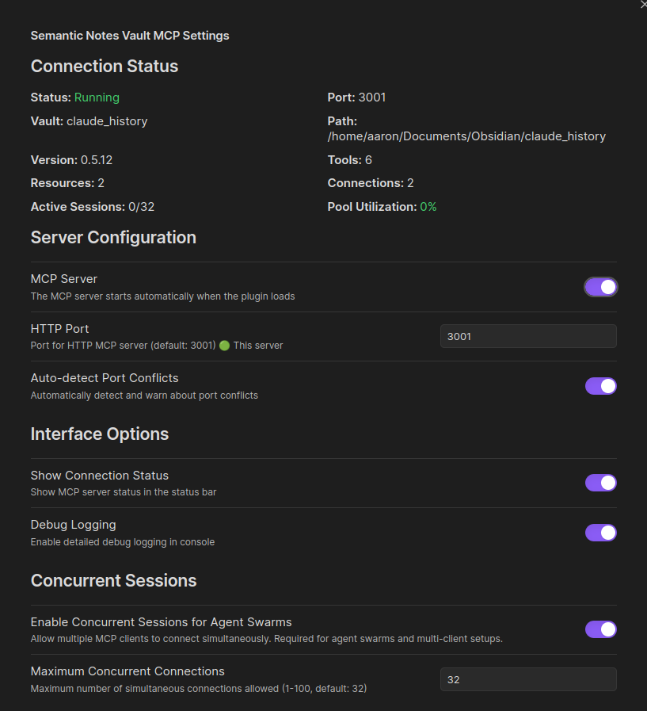

# Obsidian MCP Plugin

> **📋 Community Plugin Status**: This plugin is currently under review for inclusion in the Obsidian Community Plugins directory. Submitted on July 10, 2025 - [PR #6991](https://github.com/obsidianmd/obsidian-releases/pull/6991)

A high-performance Model Context Protocol (MCP) server implemented as an Obsidian plugin, providing AI tools with direct vault access through HTTP transport.

## Overview

This plugin brings MCP capabilities directly into Obsidian, eliminating the need for external servers or the REST API plugin. It provides semantic, AI-optimized operations that consolidate multiple tools into intelligent workflows with contextual hints.

### What are "Semantic Tools"?

Unlike basic tools that just return data, semantic tools are **self-guiding**. When an AI agent uses a semantic tool, it doesn't just get the requested information—it also receives smart suggestions about what to do next. This creates a natural workflow where each action leads intelligently to the next, helping AI agents complete complex tasks without getting stuck or needing constant human guidance.

**Example**: When searching for a file, a semantic tool doesn't just return search results. It also suggests: "Found 3 files matching 'meeting notes'. Consider using `view` to read the most recent one, or `graph traverse` to explore related documents."



### Key Features

- **Direct Obsidian Integration**: Runs natively within Obsidian for maximum performance
- **HTTP MCP Transport**: Compatible with Claude Desktop, Claude Code, Cline, and other MCP clients
- **Semantic Operations**: Enhanced search with Obsidian operators, intelligent fragment retrieval, and workflow guidance
- **No External Dependencies**: No need for the REST API plugin or external servers
- **High Performance**: Sub-100ms response times with direct vault access
- **Concurrent Sessions**: Support for multiple AI agents working simultaneously (v0.5.8+)
- **Worker Thread Processing**: CPU-intensive operations run in parallel threads for non-blocking performance
- **Path Exclusions**: `.mcpignore` file support for blocking sensitive files from AI access
- **Cloud Sync Friendly**: Smart retry logic handles file sync delays from iCloud, OneDrive, Dropbox, and other services

## 🔐 Path Exclusions with .mcpignore

Protect sensitive files and directories from AI access using `.gitignore`-style patterns.

### Overview

The plugin supports a `.mcpignore` file in your vault root that allows you to exclude specific files and directories from MCP operations. This provides a security layer ensuring that AI tools cannot access your private or sensitive content.

### Setup

1. **Enable in Settings**: Toggle "Enable Path Exclusions (.mcpignore)" in plugin settings
2. **Create Template**: Click "Create Template" to generate a starter `.mcpignore` file with examples
3. **Edit Patterns**: Use any text editor to add exclusion patterns

### Pattern Syntax

The `.mcpignore` file uses the same syntax as `.gitignore`:

```
# Directories
private/              # Excludes 'private' directory and ALL its contents
/private/            # Only excludes 'private' at vault root
work/*/confidential/ # Excludes 'confidential' dirs one level under work/

# Files
secrets.md           # Excludes this specific file
*.private           # All files ending with .private
daily/*.md          # All .md files directly in daily/

# Negation (whitelist)
!public.private     # Allow this specific file despite *.private rule
```

### Features

- **Auto-reload**: Changes to `.mcpignore` take effect immediately
- **Context Menu**: Right-click any file/folder and select "Add to .mcpignore"
- **UI Controls**: Manage from plugin settings with quick access buttons
- **Security**: Blocked paths return `PATH_BLOCKED` errors with no data leakage
- **Protected**: The `.mcpignore` file itself cannot be accessed via MCP

### Example .mcpignore

```
# Personal content
journal/
diary/
private/

# Work files
work/confidential/
clients/*/contracts/

# Temporary files
*.tmp
*.backup
.#*

# Allow specific files
!work/public-docs/
```

## ☁️ Cloud Sync Friendly

The plugin gracefully handles sync delays and file locking from cloud storage services.

### Supported Services

Works automatically with:
- **iCloud Drive** - Handles `.icloud` sync artifacts and timing conflicts
- **OneDrive** - Manages file locks and sync delays
- **Dropbox** - Handles sync markers and temporary files
- **Google Drive** - Manages sync state transitions
- **Any sync service** - Universal retry logic works with all platforms

### How It Works

The plugin automatically:
1. **Detects sync conflicts** - Recognizes EEXIST, EBUSY, and "file already exists" errors
2. **Retries intelligently** - Uses exponential backoff (500ms → 1s → 2s)
3. **Resolves timing issues** - Allows sync services time to complete operations
4. **Works transparently** - No configuration needed, just works

### Benefits

- **No phantom files** - Resolves "file already exists" errors for non-existent files
- **Reliable operations** - File creation, updates, and deletes work consistently
- **Zero configuration** - Automatic detection and handling
- **Cross-platform** - Same behavior on macOS, Windows, and Linux

## Installation

> **Note**: This plugin is currently pending review for the Obsidian Community Plugins directory. Until approved, please use the BRAT installation method below.

### Current Installation: Via BRAT (Beta Reviewer's Auto-update Tool)

Since this plugin is not yet in the Community Plugins directory, you'll need to use BRAT to install it:

1. **Install BRAT**:
   - Open Obsidian Settings → Community Plugins
   - Browse and search for "BRAT"
   - Install and enable the [BRAT plugin](https://github.com/TfTHacker/obsidian42-brat)

2. **Add This Plugin**:
   - In Obsidian settings, go to BRAT settings
   - Click "Add Beta Plugin"
   - Enter: `https://github.com/aaronsb/obsidian-mcp-plugin`
   - Click "Add Plugin"

3. **Enable the Plugin**:
   - Go to Settings → Community Plugins
   - Find "Obsidian MCP Plugin" and enable it
   - The plugin will auto-update through BRAT

### Future Installation: Via Community Plugins (After Approval)

Once this plugin is approved and available in the Obsidian Community Plugins directory:

1. Open Obsidian Settings → Community Plugins
2. Click "Browse" and search for "MCP"
3. Find "Obsidian MCP Plugin" by Aaron Bockelie
4. Click "Install" then "Enable"

> **For BRAT Users**: After the plugin is approved, you can remove it from BRAT and install it normally through Community Plugins to receive standard updates.

## Configuration

1. **Enable the Server**:
   - Go to plugin settings
   - Toggle "Enable HTTP Server" 
   - Default port is 3001 (configurable)

2. **Connect Your MCP Client**:

   ### Claude Code
   ```bash
   claude mcp add obsidian http://localhost:3001/mcp --transport http
   ```

   ### Claude Desktop / Other Clients
   
   **Option 1: Direct HTTP Transport** (if your client supports it)
   ```json
   {
     "mcpServers": {
       "obsidian": {
         "transport": {
           "type": "http",
           "url": "http://localhost:3001/mcp"
         }
       }
     }
   }
   ```
   
   **Option 2: Via mcp-remote** (recommended for Claude Desktop)
   
   Since Claude Desktop might not support streaming HTTP transport yet, use mcp-remote:
   ```json
   {
     "mcpServers": {
       "obsidian-vault-name": {
         "command": "npx",
         "args": [
           "mcp-remote",
           "http://localhost:3001/mcp"
         ]
       }
     }
   }
   ```

   Configuration file locations:
   - macOS: `~/Library/Application Support/Claude/claude_desktop_config.json`
   - Windows: `%APPDATA%\Claude\claude_desktop_config.json`
   - Linux: `~/.config/Claude/claude_desktop_config.json`

### Concurrent Sessions for Agent Swarms (v0.5.8+)

Enable multiple AI agents to work with your vault simultaneously without blocking each other:

1. **Enable in Settings**:
   - Go to plugin settings
   - Find "Concurrent Sessions" section
   - Toggle "Enable Concurrent Sessions for Agent Swarms"
   - Adjust max connections if needed (default: 32)

2. **Architecture**:
   - Each AI session gets its own isolated MCP server instance
   - True parallel processing - no blocking between sessions
   - Automatic session management with 1-hour timeout
   - Session reuse for reconnecting clients

3. **Monitor Active Sessions**:
   - Use the `obsidian://session-info` resource to view:
     - Active sessions with "This is you!" indicator
     - Session age, idle time, and request counts
     - Server pool utilization statistics

4. **Use Cases**:
   - Multiple Claude instances working on different parts of your vault
   - AI agent teams collaborating on research or writing projects
   - Parallel processing of large knowledge bases
   - Non-blocking operation for time-sensitive workflows

## Available Tools

### 🗂️ `vault` - File and Folder Operations
- `list` - List files and directories
- `read` - Read file content with fragments for large files
- `create` - Create new files and directories
- `update` - Update existing files
- `delete` - Delete files and folders
- `search` - Enhanced search with Obsidian operators
- `fragments` - Get relevant excerpts from files
- `move` - Move files to new locations (preserves links)
- `rename` - Rename files in place (preserves links)
- `copy` - Create copies of files
- `split` - Split files by headings, delimiter, lines, or size
- `combine` - Merge multiple files with sorting options
- `concatenate` - Simple two-file joining

**🔍 Search Operators**:
- `file:` - Search by filename or extension (e.g., `file:.png`)
- `path:` - Search in file paths
- `content:` - Search only in file content
- `tag:` - Search for tags
- `"exact phrase"` - Search for exact phrases
- `term1 OR term2` - Search for either term
- `/regex/flags` - Regular expression search

### ✏️ `edit` - Smart Editing Operations  
- `window` - Edit with automatic content buffering
- `append` - Append content to files
- `patch` - Intelligent patching with fuzzy matching
- `at_line` - Edit at specific line numbers
- `from_buffer` - Recover content from edit buffers

### 👁️ `view` - Content Viewing and Navigation
- `file` - View complete files with metadata
- `window` - View content windows with context
- `active` - Get currently active file
- `open_in_obsidian` - Open files in Obsidian

### 🔄 `workflow` - AI Workflow Guidance
- `suggest` - Get contextual suggestions based on current operations

### 🕸️ `graph` - Graph Traversal and Link Analysis
- `traverse` - Explore connected nodes from a starting point
- `neighbors` - Get immediate connections of a file
- `path` - Find paths between two nodes
- `statistics` - Get link counts and statistics for files
- `backlinks` - Find all incoming links to a file
- `forwardlinks` - Find all outgoing links from a file
- `search-traverse` - Search-based graph traversal with snippet chains
- `advanced-traverse` - Multi-query traversal with strategies (breadth-first, best-first, beam-search)

**Graph Features**:
- `links/backlinks/tags` - Follow connections during traversal
- `pattern/folder/tag filters` - Filter by file patterns, folders, or tags
- `depth/max_nodes` - Control traversal depth and maximum nodes
- `relevance_scores` - Get relevance scores and snippet chains
- `orphaned/unresolved` - Support for orphaned notes and unresolved links

### ⚙️ `system` - System Operations
- `info` - Get vault and plugin information
- `commands` - List and execute Obsidian commands
- `fetch_web` - Fetch and convert web content to markdown

## Configuration

### Plugin Settings

Access plugin settings via Obsidian Settings → Community Plugins → Obsidian MCP Plugin → Settings

- **HTTP Port**: Port for MCP server (default: 3001)
- **Enable Concurrent Sessions**: Allow multiple AI agents to work simultaneously (default: enabled)
- **Max Concurrent Connections**: Maximum number of parallel operations (default: 32)
- **Path Exclusions (.mcpignore)**: Enable/disable path blocking via `.mcpignore` file
- **Enable Context Menu**: Add "Add to .mcpignore" to file/folder right-click menus
- **Debug Logging**: Enable detailed console logging for troubleshooting

### Concurrent Sessions (v0.5.8+)

The plugin supports multiple AI agents working simultaneously through session-based connection pooling:

- Each MCP client gets a unique session ID
- Sessions are isolated and tracked independently
- CPU-intensive operations (search, graph traversal) can run in parallel
- Worker threads prevent blocking the main Obsidian UI
- Sessions automatically expire after 1 hour of inactivity

**Performance with Concurrent Sessions**:
- Up to 32 simultaneous operations (configurable)
- Worker threads for CPU-intensive tasks
- Non-blocking UI during heavy operations
- Automatic session cleanup and resource management

## MCP Resources

- **`obsidian://vault-info`** - Real-time vault metadata including file counts, active file, and plugin status
- **`obsidian://session-info`** - Active sessions and connection pool statistics (when concurrent sessions enabled)

## Key Improvements Over External MCP Servers

1. **Performance**: Direct vault access eliminates HTTP overhead
2. **Search**: Uses Obsidian's native search with advanced operators
3. **Integration**: Access to full Obsidian API and plugin ecosystem
4. **Simplicity**: Single plugin installation, no external dependencies
5. **Reliability**: No separate processes to manage or crash

## Architecture

This plugin implements the same semantic operations as [obsidian-semantic-mcp](https://github.com/aaronsb/obsidian-semantic-mcp) but runs directly within Obsidian:

```
Before: AI Tool → MCP Server → REST API Plugin → Obsidian
Now:    AI Tool → MCP Plugin (within Obsidian)
```

The critical `ObsidianAPI` abstraction layer is preserved, allowing all semantic operations to work identically while gaining the performance benefits of direct integration.

## Testing Status

✅ **Working Features**:
- All 6 semantic tools with all actions
- Enhanced search with Obsidian operators
- Graph traversal and link analysis
- Image viewing and file operations
- Fragment retrieval for large files
- Workflow hints and guidance
- Multi-vault support
- Port collision detection
- Cross-platform tested (Linux, Windows, macOS)

⚡ **Performance Results**:
- File operations: <10ms (vs ~50-100ms with REST API)
- Search operations: <50ms (vs ~100-300ms)
- Zero network overhead

## Development

```bash
# Clone to your vault's plugins folder
git clone https://github.com/aaronsb/obsidian-mcp-plugin .obsidian/plugins/obsidian-mcp-plugin

# Install dependencies
npm install

# Build for development
npm run dev

# Build for production
npm run build
```

## Support

- **Issues**: [GitHub Issues](https://github.com/aaronsb/obsidian-mcp-plugin/issues)
- **Discussions**: [GitHub Discussions](https://github.com/aaronsb/obsidian-mcp-plugin/discussions)

## License

MIT

---

*This plugin brings the power of semantic MCP directly into Obsidian, providing AI tools with intelligent, high-performance vault access.*
